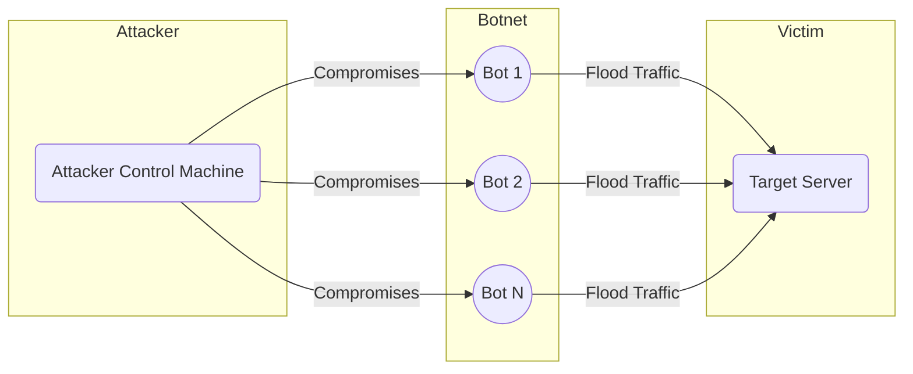
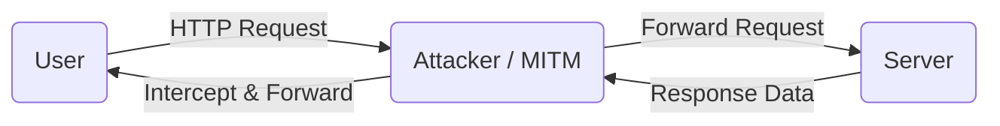
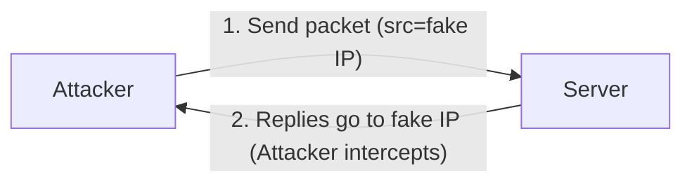
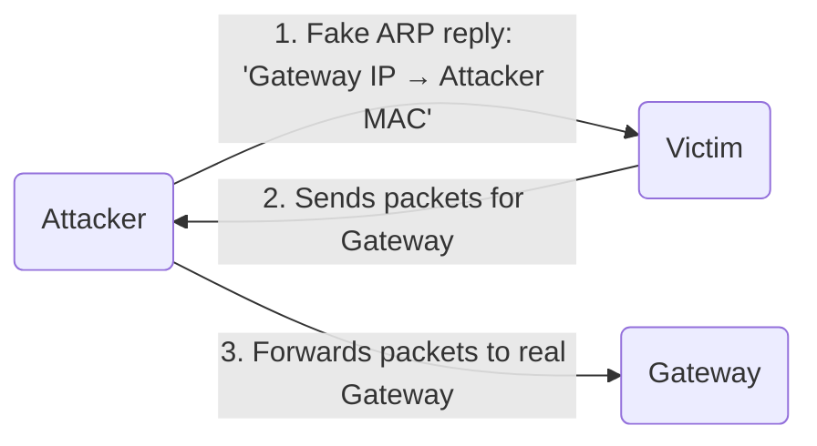

# Network Security Threats Report

## Executive Summary

This report examines **Denial-of-Service (DoS/DDoS)**, **Man-in-the-Middle (MITM)**, and **Spoofing** attacks (including IP, ARP, DNS, and email spoofing). Each threat is defined, its technical mechanism explained (with protocol details), and real-world examples are given. We discuss indicators of compromise, business/technical/legal impacts, detection methods, mitigation strategies (network/host/application/policy controls), and incident response steps. The report includes flowchart diagrams (using Mermaid) illustrating attack flows for each threat category, a comparative summary table of the threats, a network administrator checklist of preventive measures, and a glossary of key terms. Authoritative sources (CERTs, NCSC, vendor advisories, industry reports) are cited throughout.

## Denial-of-Service (DoS/DDoS) Attacks

### Definition and Types

A **Denial-of-Service (DoS)** attack attempts to **overwhelm a target system** (server, network, or service) so that it becomes unavailable to legitimate users. Typically it floods the target with excessive requests or exploits resource vulnerabilities. A **Distributed DoS (DDoS)** uses many systems (often a botnet) in concert, making traffic floods far larger and tracing the attacker more difficult. DoS attacks can target different protocol layers:

- **Volumetric (Network) Floods:** e.g. UDP/ICMP floods or amplification attacks (DNS, NTP reflection) that saturate bandwidth.
- **Protocol Attacks:** e.g. TCP SYN flood, exploiting state tables; they consume server resources.
- **Application-Layer Attacks:** e.g. HTTP floods or Slowloris that exhaust web server processes, mimicking legitimate traffic.

A **botnet** (network of compromised devices) is often used to launch these floods. Attackers commonly **spoof source IPs** so traffic appears to come from many (nonexistent or third-party) hosts.

### Indicators of Compromise

Signs of a DoS/DDoS include **sudden traffic spikes** and resource exhaustion:

- **Unusual traffic surge** from one or many IPs, often with incomplete connections (indicating spoofed sources). 
- **Slow or irregular performance** on websites or services (delayed page loads, timeouts).
- **Server error messages or timeouts**, e.g. HTTP 503 Service Unavailable, or network hardware errors.
- **User complaints** of connectivity issues across services sharing the network.
- **Alerts from ISPs or cloud providers** about abnormal traffic patterns.

Network/log indicators: unusually high bandwidth usage, large numbers of half-open TCP connections (for SYN flood), spikes in specific protocol (e.g. UDP) usage, or unexpected amplification traffic (DNS/UDP spikes).

### Impact

DoS/DDoS attacks can have severe impacts:
- **Business Impact:** Lost revenue during downtime, productivity loss, contractual SLA violations. Attacks can cost organizations thousands to millions per hour.
- **Operational Impact:** Outage of customer-facing services, impaired internal operations, emergency IT escalation.
- **Reputation:** Customers lose trust if services are unreliable.
- **Security Risk:** A DoS might mask or precede other attacks (intrusions), exposing secondary vulnerabilities.
- **Legal/Compliance:** Extended outages can lead to regulatory penalties (e.g. for financial services or healthcare).

### Real-World Examples

- **Mirai Botnet (2016):** Malware-infected IoT devices (routers, cameras) were hijacked to create massive botnets. In September 2016 Mirai’s source code was released, and in October 2016 the **Dyn DNS** DDoS used ~100,000 IoT devices to overwhelm DNS infrastructure, causing widespread outages.
- **Spamhaus (2013):** A huge DNS amplification DDoS peaked at ~300 Gbps against the anti-spam group Spamhaus. Attackers spoofed IPs to generate massive UDP floods.
- **GitHub (2018):** Record DDoS over 1.35 Tbps (Memcached reflection) knocked GitHub offline briefly.
- **Cloud Service Attacks:** Exploits of open DNS/NTP; e.g. Google’s Cloudflare blog notes 2013 attacks with spoofed sources and our sources list others.

### Detection

DDoS detection relies on traffic analysis and monitoring:
- **Network Monitoring:** Baseline normal traffic patterns and trigger alerts on unusual volume, protocol anomalies or geographic/IP concentration.
- **Anomaly Detection:** IDS/IPS or NDR solutions can flag spikes in SYN/RST rates, malformed packets, or UDP floods.
- **Logs/Alerts:** Look for rising SYN backlog, CPU overload, or alerts from security appliances.
- **External Alerts:** ISPs or upstream providers often notify customers of large upstream flows originating from their networks.

### Mitigation and Prevention

Effective DDoS defense is multi-layered:
- **Traffic Scrubbing and Absorption:** Use cloud-based DDoS mitigation services or Content Delivery Networks (CDNs) that can absorb large floods. CDNs distribute incoming traffic geographically, effectively diffusing volumetric attacks.
- **Firewalls and WAFs:** Web Application Firewalls can block known attack patterns (e.g. illegal HTTP floods). Firewalls can rate-limit or geo-block suspicious IPs.
- **Rate Limiting:** Set per-IP or per-connection rate limits to throttle traffic bursts.
- **Blackhole/Anycast Routing:** In an extreme attack, routing traffic to a null route can protect core network segments. (Used as last resort, as it also drops legitimate traffic).
- **Network Filters:** Implement **ingress/egress filtering** (BCP38) to drop spoofed packets at the edge. Upstream providers can help filter out attack traffic.
- **Redundancy and Scaling:** Overprovision bandwidth where possible, deploy load balancers, and have failover sites ready.
- **Continuous Monitoring:** 24/7 traffic analysis with IDS/IPS, and maintain logging to quickly identify an ongoing attack.
- **Secure Protocols:** Ensure services use non-spoofable authentication (like SSL/TLS) for control channels, to limit protocol-level exploits.

### Incident Response and Recovery

Per NCSC guidance, a DoS response plan should:
1. **Confirm the Attack:** Gather network/system telemetry (traffic logs, bandwidth, CPU/disk stats). Distinguish between malicious surges and legitimate spikes (e.g. news coverage).
2. **Activate Defenses:** If confirmed malicious, enable pre-planned defenses (scrubbing, blackhole, WAF rules). Work with ISPs/CDNs to filter or sinkhole attack traffic. For example, implement rate-limits or block offending IP ranges.
3. **Maintain Communication:** Inform stakeholders (management, staff, customers) about service degradation and mitigation actions. Coordinate with upstream providers/share threat intelligence (e.g. attacker IP addresses).
4. **Continuous Monitoring:** Watch traffic trends – is volume dropping, legitimate traffic returning. Be vigilant for potential secondary attacks.
5. **Recover Systems:** Once attack subsides (traffic normalizes, error rates drop), remove temporary blocks/filters and restore disabled services. Clean up any compromised network configurations.
6. **Post-Incident Review:** Analyze logs to identify attack vectors, effectiveness of defenses, and gaps. Update the DoS mitigation plan accordingly.

If funds/data were affected (e.g. extortion demand), notify authorities (e.g. CERT, law enforcement). For minimized downtime, ensure backups are in place for critical systems and test failover plans regularly.

## Man-in-the-Middle (MITM) Attacks

### Definition and Types

A **Man-in-the-Middle (MITM)** attack is when an adversary secretly **intercepts or alters** the communications between two parties (e.g. user and server). The attacker can eavesdrop, steal credentials, and inject malicious content. MITM often occurs via insecure networks (public Wi-Fi, compromised routers) or by hijacking session protocols.

MITM attacks typically involve two phases:
1. **Interception:** Attacker inserts themselves between victim and destination (e.g. by ARP spoofing, rogue Wi-Fi AP, DNS hijack).
2. **Decryption/Relay:** Attacker relays (and possibly decrypts) the traffic transparently, forwarding requests/responses so neither party detects the intrusion.

Common MITM techniques:
- **Rogue Wi-Fi/Evil Twin:** Attacker sets up a wireless access point impersonating a legitimate network; all client traffic passes through attacker.
- **SSL/TLS Hijacking:** Presenting fake HTTPS certificates (often via compromised CAs or pre-installed keys) lets attacker decrypt TLS traffic (as in the Lenovo Superfish case).
- **ARP Spoofing (LAN MITM):** Attacker sends fake ARP messages on a LAN so that traffic meant for the gateway or another host is sent to the attacker instead.
- **DNS Spoofing (Poisoning):** Manipulating DNS lookups (either by corrupting cache or impersonating DNS servers) to redirect victims to malicious IPs.
- **IP/MAC Spoofing:** Masquerading as a known device at the network or IP layer.

### Indicators of Compromise

MITM attacks can be stealthy, but some signs include:
- **Certificate Warnings:** Browsers or apps may warn of invalid or self-signed certificates during connections (if the MITM uses fake certs).
- **Repeated Logins/Disconnects:** Users get logged out unexpectedly or must re-authenticate frequently (suggests session hijacking attempts).
- **Unexpected Redirects:** Requests to legitimate domains redirect to unfamiliar IPs or HTTPS certificates mismatch the expected domain.
- **Suspicious URLs or Domains:** Users notice phishing-like URLs in emails or browsers (e.g. subtle typos or extra characters).
- **Unsecured Wi-Fi:** Presence of "free" or oddly-named Wi-Fi hotspots in public places, especially if users later see credential theft.
- **Network Anomalies:** ARP tables showing duplicate IP-MAC entries (Victim and Attacker have same IP), ARP cache changes, or unexpected DNS servers in use.

### Impact

MITM attacks can have serious consequences:
- **Data Theft:** Attackers capture credentials, financial information, personal data (PII). They can use this for fraud, identity theft, or gain corporate access.
- **Fraud and Extortion:** Stolen credentials can be used for unauthorized transactions (e.g. redirecting invoices to attacker accounts as in BEC) or ransomware.
- **Privacy Breach:** Sensitive communications (emails, chats) are exposed. In industry espionage, MITM can leak intellectual property.
- **Erosion of Trust:** Victims unaware of interception may trust compromised services. Businesses suffer reputational damage when clients’ data is intercepted.
- **Legal/Regulatory:** Data breaches via MITM can violate privacy laws (e.g. GDPR, HIPAA), leading to fines and lawsuits.

The cost of MITM is high: Coalition reports note criminals steal payment details and pivot to financial fraud, causing significant losses. Fortinet cites average small-business cyberattack loss ~$55K. MITM can also facilitate widespread breaches (NSA’s SSL spoof on Google, Equifax breach involvement).

### Real-World Examples

- **Lenovo/Superfish (2015):** Lenovo shipped laptops with preinstalled “Superfish” adware that installed a self-signed root SSL certificate. This allowed MITM of HTTPS: Superfish could decrypt and inject content into secure web pages without browser warnings.
- **NSA Tapping Google (2007):** Leaked NSA documents revealed an operation (“Muscular”) where the NSA intercepted Google and Yahoo data by spoofing SSL certificates between data centers. All Google user search traffic (including Americans) was captured via this MITM.
- **Europol Bank Fraud (2015):** A group of 49 cybercriminals used MITM (by compromising email) to steal from European companies. They intercepted employee emails, modified payment instructions, and diverted funds to attacker-controlled accounts.
- **Public Wi-Fi Scams:** Attackers commonly set up fake Wi-Fi hotspots (“Free Airport Wi-Fi”) to MITM user traffic. While surfing, victims unknowingly send credentials via the attacker’s proxy.

### Detection and Mitigation

**Detection:**  
- Employ **network monitoring** (IDS/IPS) to flag ARP cache anomalies, duplicate IPs, or DNS mismatches. For example, tools can alert if an ARP reply changes the MAC for a known IP.  
- Use **certificate pinning and validation** on client apps/browsers. Mismatched cert chains or unrecognized root CAs indicate possible interception.  
- Train users to verify URLs and padlock symbols. Unexpected SSL warnings should be investigated (could signal SSL hijacking).

**Mitigation:**  
- **Encryption Everywhere:** Mandate HTTPS/TLS for web services. Use HSTS and certificate pinning to prevent downgrade or spoof (Fortinet recommends “only connect to secure websites”).  
- **Strong Wi-Fi Security:** Encrypt Wi-Fi with WPA3/WPA2 and complex passwords. Disable open networks. Rapid7 suggests VPN usage to encrypt data on Wi-Fi.  
- **VPN and End-to-End Encryption:** Use VPNs when on public networks and encourage end-to-end encryption for emails/messaging.  
- **Secure Routing and DNS:** Implement DNSSEC and DNS-over-HTTPS/TLS to ensure DNS queries aren’t intercepted.  
- **ARP Protection:** On local networks, enable Dynamic ARP Inspection (DAI) and use static ARP entries for critical hosts. This prevents malicious ARP replies.  
- **Network Segmentation:** Limit LAN blast radius by segmenting networks (e.g. IoT and guest WLAN separate from corporate network).  
- **Regular Updates:** Keep systems patched (routers, firmware). Outdated SSL/TLS libraries or OSs are more vulnerable to MITM exploits.  
- **Zero Trust:** Adopt a zero-trust model (“never trust, always verify”): authenticate and encrypt all internal traffic, use micro-segmentation.  
- **Authentication Controls:** Enforce multi-factor authentication to reduce risk if credentials are captured. Use strong passwords and monitors for unusual login behavior.

### Incident Response and Recovery

If a MITM compromise is suspected:
1. **Identify the Vector:** Determine how the attacker interposed. Check ARP tables, known proxy settings, and certificate stores on clients. Scan for rogue APs or DNS hijacking.
2. **Block the Attacker:** On the LAN, clear poisoned ARP caches and enable port/security features (DAI, static ARP). On web sessions, revoke or replace compromised certificates and keys.
3. **Quarantine Affected Systems:** Disconnect or isolate compromised devices (e.g. infected router or client). Reset credentials and regenerate any affected keys/certificates.
4. **System Recovery:** For email-based MITM, ensure email systems are patched and secure. If company-issued software enabled the attack (e.g. certificate in trust store), force removal of malicious certificates (as with Superfish).  
5. **Notification:** Inform users and partners if sensitive data may have been exposed. Depending on the breach, notify regulators (e.g. if personal data was intercepted).  
6. **Forensic Analysis:** Collect logs (network captures, system logs) to understand scope of data captured. Check for lateral movement or additional malware.  
7. **Post-Incident Measures:** Conduct a post-mortem. Update policies (e.g. disable weak ciphers), improve monitoring (e.g. implement continuous UX monitoring/UEBA as Fortinet suggests), and re-educate users on safe practices.

## Spoofing Attacks

**Spoofing** involves forging identity information in network communication. Common types include:

### IP Spoofing

**What it is:** The attacker crafts IP packets with a **fake source IP address**. This makes the packet appear from a trusted or innocent host. Often used to hide attacker’s identity or amplify attacks (since replies go to the spoofed IP).

**How it works:** The attacker picks a source IP (e.g. of a victim) and sends packets to a target server with that fake source. The server then sends responses back to the impersonated IP (which the attacker intercepts if positioned accordingly). For example, in a DDoS context, millions of spoofed packets flood the target, and the target’s replies overwhelm the spoofed victim.  

**Impact:** IP spoofing by itself doesn’t guarantee success, but it facilitates **DDoS/DoS** and **session hijacking**. It complicates attribution of attacks and can allow attackers to bypass IP-based authentication. Spoofed packets can also carry attacks that exploit protocol trust.

**Examples:** The Spamhaus DDoS (2013) used massive IP spoofing for DNS amplification. Any reflective/amplification DDoS uses IP spoofing (NTP, DNS reflection, etc).

**Detection:** Network devices can detect impossible routes (e.g. reverse-path filtering). An IDS/IPS may log mismatches between packet source and observed network paths.

**Mitigation/Prevention:**  
- **Ingress/Egress Filtering:** Block incoming packets whose source IP is not from expected ranges (BCP38). This stops many spoofed packets at the network edge.  
- **Reverse Path Forwarding (RPF):** Enable uRPF on routers to drop packets whose source IP is not reachable via the interface they arrived.  
- **Packet Validation:** Use firewalls/IDS rules to drop anomalies (e.g. packets from unroutable IPs or with mismatched TTLs).  
- **Network Access Controls:** Lock down network so devices only see traffic for their IP/MAC; isolate critical hosts.

### ARP Spoofing (ARP Poisoning)

**What it is:** On a local network, ARP spoofing is the attacker sending false ARP messages to associate the attacker’s MAC address with the IP of another host (e.g. the gateway). Other devices then send traffic to the attacker instead of the real host.

**How it works:** Typically, the attacker repeatedly sends forged ARP replies: “IP 192.168.1.1 is at Attacker’s MAC”. Victims update their ARP cache with the fake mapping. Subsequent traffic intended for that IP is sent to the attacker. The attacker can then **relay or modify** the traffic before forwarding it to the real destination, performing MITM on a LAN.

**Indicators:**  
- Duplicate ARP replies in traffic captures.  
- The victim’s ARP table listing the same IP for two different MACs.  
- Unexpected network latency or routing loops (if traffic keeps going through attacker).  

**Impact:** ARP spoofing gives a full MITM capability on LAN. Sensitive data (passwords, file transfers) can be eavesdropped or altered. Industrial control networks are especially vulnerable (adding malicious commands to PLC traffic).

**Mitigation:**  
- **Dynamic ARP Inspection (DAI):** Configure switches with DAI to validate ARP replies against a trusted database. Suspicious ARP packets are dropped.  
- **Static ARP Entries:** For critical devices, use static ARP mappings so they don’t accept unsolicited ARP replies.  
- **Segmentation:** Keep wireless/LAN and wired networks separate for sensitive devices.  
- **Use IPv6 (Neighbor Discovery with RSA):** IPv6’s ND protocol with SEND (Secure Neighbor Discovery) resists spoofing.

### DNS Spoofing (DNS Cache Poisoning)

**What it is:** Attackers introduce false DNS records, causing domain names to resolve to malicious IPs. This can be done by compromising a DNS server or intercepting DNS queries (MITM on DNS).

**How it works:** For example, an attacker poisons the victim’s DNS resolver cache so that “bank.example” resolves to an attacker-controlled IP. The victim unknowingly visits the fake site. Attacks include **DNS cache poisoning**, **rogue DNS server hijacking**, and **DNS response tampering**.

**Impact:** Users and applications are redirected to fraudulent websites (phishing, malware downloads) or rogue servers. Organizations see service outages or brand hijacking. Examples:
- *Malaysia Airlines (2015):* DNS spoof redirected users away from the real site.
- *Cryptocurrency Theft (2018):* Attackers used DNS spoofing via AWS to steal ~$17M in Ethereum.
- *Sea Turtle (2019):* Large-scale DNS hijacking hit government and telecom sectors.

**Indicators:**  
- Unexpected IP addresses when doing DNS lookups (e.g. via `nslookup`).  
- Certificates mismatch the domain (the DNS might be right but SSL cert from another domain).  
- Users unable to reach legitimate sites but reach others with similar names.  

**Mitigation:**  
- **DNSSEC:** Deploy DNS Security Extensions to add cryptographic signatures to DNS responses. Validating DNSSEC rejects forged responses.  
- **TLS/SSL Certificates:** Use HTTPS on all services so clients can detect if the IP they reached doesn’t match the expected certificate.  
- **Monitoring:** Continuously monitor DNS traffic for abnormal patterns (sudden changes in DNS records or query volumes).  
- **Restrict DNS Updates:** Only allow secure dynamic updates on DNS servers; keep software patched.  
- **Local DNS Controls:** Some enterprises use DNS filtering/reputation services to block known malicious domains.
- **End-Point Hardening:** Ensure user devices use trusted DNS servers (e.g. Google DNS or internal DNS with DNSSEC) and employ DNS-over-HTTPS/TLS where possible to prevent interception.

### Email Spoofing

**What it is:** Forging the “From” header or other email fields so that an email appears to originate from a legitimate source (e.g. a company or person). Commonly used in phishing and Business Email Compromise (BEC).

**How it works:** The attacker crafts an email with a fake sender address. Recipients see the email as coming from someone they trust. Attackers may also spoof reply-to addresses or hide malicious URLs under misleading text.

**Impact:**  
- **Phishing and Fraud:** Victims may click malicious links, download malware, or send sensitive data to the attacker. In BEC scams, attackers trick finance staff into transferring funds to fraudulent accounts. IC3 reports cite **tens of billions of dollars lost** to such scams globally.  
- **Spam and Malware Distribution:** Spoofed emails often carry attachments or links that infect networks.

**Indicators:**  
- The email domain may look slightly off (e.g. microsofts.com vs microsoft.com).  
- SPF/DKIM/DMARC failures: many mail servers now tag or drop mails that fail authentication checks.  
- Mismatched “From” and “Reply-To” headers or odd server name in the email source.

**Mitigation:**  
- **Email Authentication:** Implement SPF, DKIM, and DMARC records for your domains to verify legitimate senders. These DNS-based methods let receivers validate if an email is truly from that domain, blocking forged senders.  
- **Security Gateways:** Use an email gateway or secure email service that rejects or quarantines mails failing auth checks.  
- **User Training:** Educate staff to check email headers, not to trust urgent requests blindly, and to verify via separate channels (phone call) before any financial transaction.  
- **2FA and Policies:** As FBI advises, require two-factor authentication and secondary confirmation for transfer-of-funds requests. Ensure full email addresses and URLs are visible (not masked).
- **DMARC Policies:** Enforce a strict DMARC policy (quarantine/reject) on high-value domains to prevent impersonation.

**Incident Response:** For successful email spoofing or BEC: Immediately notify financial institutions to recall transactions. Reset compromised accounts (email and related). Evaluate logs to identify phishing entry, then tighten email filters and employee awareness. Report incidents to law enforcement as they often track these sophisticated scams.

## Comparative Summary of Threats

| **Threat**       | **Attack Vector**            | **Typical Targets**               | **Severity**          | **Ease of Detection** | **Mitigation Complexity** |
|------------------|------------------------------|-----------------------------------|-----------------------|-----------------------|---------------------------|
| **DoS/DDoS**     | Flooding with bogus traffic (volumetric/protocol/app)   | Web servers, network infrastructure, critical services  | High (causes outages) | Moderate (monitoring needed) | High (requires specialized tools/CDN) |
| **MITM**         | Intercepting communications (e.g. rogue Wi-Fi, ARP poisoning, SSL spoofing) | Any client-server communication (web, email, VPN)    | High (data theft, fraud) | Low (hard to spot stealthily) | Moderate (encrypt and verify) |
| **IP Spoofing**  | Forging packet source addresses | Servers used in flood attacks, systems trusting IPs | Medium (enables DoS, bypassing) | Moderate (network logs analysis) | Moderate (filtering/routing configs) |
| **ARP Spoofing** | Malicious ARP replies on LAN | LAN hosts and gateways | Medium (local MITM) | Moderate (network scanning) | Moderate (switch configs) |
| **DNS Spoofing** | Poisoning DNS responses/cache | Any internet user (redirects), DNS servers | High (phishing/malware delivery) | Moderate (monitor DNS integrity) | High (requires DNSSEC, secure configs) |
| **Email Spoofing** | Forging email headers (From address) | Organizational email recipients (BEC targets) | Medium-High (phishing, financial fraud) | Moderate (auth systems and awareness) | Moderate (SPF/DKIM/DMARC setup) |

## Preventive Measures Checklist

Network administrators should adopt a multi-layered security posture. Key preventive measures include:

- **Keep Systems Updated:** Regularly patch OS, applications, firmware (routers/switches/servers) to fix known vulnerabilities (mitigates exploits used in these attacks).  
- **Network Segmentation:** Separate sensitive networks (e.g. finance, ICS/OT) from general LAN/Wi-Fi. Use VLANs and firewalls to limit lateral movement.  
- **Encryption and Authentication:** Enforce TLS/SSL on all services. Use VPNs for remote access and WPA3 on Wi-Fi. Require strong authentication (MFA) everywhere.  
- **Ingress/Egress Filtering:** Apply RFC2827 (BCP38) filters on routers to block spoofed IP traffic.  
- **Intrusion Detection/Prevention:** Deploy IDS/IPS with signatures for DoS patterns and spoofing (ARP, DNS anomalies). Monitor logs and set alerts for unusual traffic.  
- **Rate Limiting and WAFs:** Configure web/app servers with request rate limits. Use a web application firewall to block common attack payloads (HTTP flood patterns).  
- **DNS Security:** Implement DNSSEC on authoritative servers and validate on resolvers. Use reputable DNS providers and consider DNS-over-HTTPS/TLS. Monitor DNS records for unauthorized changes.  
- **Email Authentication:** Publish SPF, DKIM, and DMARC records and enforce them. Use email filtering appliances to reject spoofed messages.  
- **ARP Protections:** Enable dynamic ARP inspection (DAI) on switches. Maintain static ARP entries for critical devices where feasible.  
- **Monitoring and Logging:** Continuously monitor network traffic (netflow, SNMP stats). Collect logs centrally (SIEM) to spot attack patterns.  
- **Redundancy and Capacity:** Use CDNs or anycast for critical web assets. Overprovision bandwidth if budget allows. Have DDoS scrubbing services or partnerships with providers who offer anti-DDoS.  
- **Employee Training:** Educate users about phishing and safe Wi-Fi usage. Remind them to verify unexpected requests via phone or second email channel.  
- **Incident Response Planning:** Develop and test a DoS/MITM incident response plan. Include contact info for ISP/cloud support, set up automated playbooks, and conduct tabletop exercises.  
- **Backup and Recovery:** Maintain offline backups of critical data. Test system restore procedures in case of a catastrophic attack.  
- **Security Policies:** Enforce least privilege (only necessary services open). Regularly review firewall and ACL rules. Remove unused services and protocols (disable IPv4 if only IPv6 is used, etc.).

## Glossary of Key Terms

- **DoS (Denial-of-Service):** An attack that attempts to make a system or network unavailable by overwhelming it with traffic or requests.
- **DDoS (Distributed DoS):** A DoS attack using multiple compromised sources (botnet), making it more powerful and difficult to defend.
- **Botnet:** A network of compromised computers or devices under attacker control, often used to launch large-scale DDoS floods.
- **MITM (Man-in-the-Middle):** An attack where a malicious actor secretly intercepts and possibly alters communication between two parties.
- **IP Spoofing:** Crafting IP packets with a forged source address to masquerade as another host.
- **ARP (Address Resolution Protocol):** A protocol mapping IP addresses to MAC addresses in a local network. **ARP Spoofing** involves sending fake ARP replies to divert traffic.
- **DNS (Domain Name System):** Translates domain names to IP addresses. **DNS Spoofing** (cache poisoning) corrupts DNS responses so domains resolve to malicious IPs.
- **DNSSEC:** Security Extensions for DNS that add cryptographic signatures to DNS records, preventing spoofed responses.
- **SPF (Sender Policy Framework):** An email authentication method allowing domain owners to specify which mail servers may send email for the domain.
- **DKIM (DomainKeys Identified Mail):** Email authentication by digitally signing outgoing mail headers, enabling receivers to verify the source domain.
- **DMARC (Domain-based Message Authentication Reporting and Conformance):** A policy layer on top of SPF/DKIM telling receivers how to handle emails failing authentication (e.g. reject or quarantine).
- **WAF (Web Application Firewall):** A specialized firewall that filters and blocks malicious web traffic (e.g. HTTP floods or SQL injection) at the application layer.
- **Encryption (TLS/SSL):** Protocols that secure data in transit. Strong encryption thwarts MITM by ensuring data cannot be decrypted by intermediaries.

Each definition above is based on authoritative sources or standards. For example, DoS and DDoS definitions are drawn from cybersecurity guidance, and email authentication terms from Cloudflare’s documentation.

